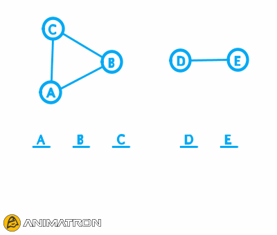
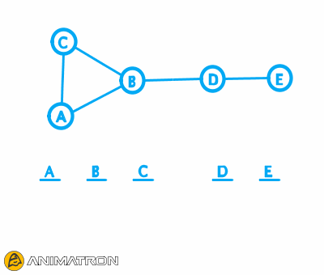
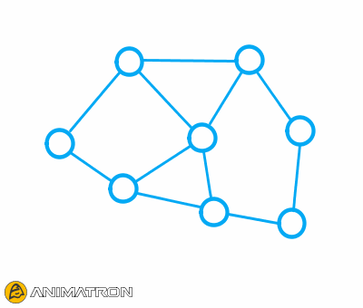

# Club

Is a decentralized, peer to peer networking library written in C++11 designed for use in multiplayer games. One of its primary design goals is to free developers from having to host high performance game servers while also to maintain an easy to use interface. Such dedicated servers are ideal for top tier multiplayer shooter games, but they are also very expensive and thus infeasible for games with a smaller budget.

On the other hand, decentralized systems add another layers of complexity on top of already complex matter. There are problems such as: Not every node can connect to every other node directly, or packets from different sources may be received by other nodes in different order, and in cases of network partition, there is no central authority that says who is in the game and who is not, etc.

Club implements solutions to such problems and hides this complexity behind a simple to use API.

## Features

#### Group membership consensus

In a traditional network game engine, developers provide a host server. When players want to join a game, they contact this server which then grants the user access a lobby. This way, the host decides lobby membership as well as the order in which users became members and forwards this information back to users.

  

Club uses a different approach, instead of relying on a single node to do the decision, it uses a distributed membership consensus algorithm. That is, when a group of nodes *A* joins another group of nodes *B* (by establishing a connection between a node from *A* with a node from *B*), the consensus algorithm ensures that every node from *A* shall receive a list of nodes from *B* and vice versa.

  

Additionally, in cases when one or more node pairs get disconnected the algorithm ensures that every node in every [connected component](https://en.wikipedia.org/wiki/Connected_component_(graph_theory)) that remains shall receive the same membership change information. This makes decision making after reconfiguration as simple (if not simpler) as with the standard approach.

#### Total order reliable broadcast

For important game decisions, such as whether to leave the lobby and start the game, or whether player #1 acquired a coin before player #2 did, Club ships with an algorithm to totally order some messages. That is, say that player #1 and player #2 sent a message, Club makes a guarantee that if someone receives the message from #1 before message from #2, then everyone else does as well.

#### Fast unreliable message broadcast and routing

  

Apart from knowing who is currently present in the group, the library also tracks who is connected to whom. Given this information, it is able to construct an efficient routing table for delivering messages.

#### UDP hole punching for NAT traversal

[Most](http://nattest.net.in.tum.de/results.php) of the devices on the internet today are behind some kind of NAT that prevents two nodes to connect to each other directly. This may be either a home router, a firewall or it can be the ISP. There are techniques to get around these restrictions, from which the [UDP hole punching](https://en.wikipedia.org/wiki/UDP_hole_punching) one is considered most efficient.

TODO: Symmetric NATs

#### Rendezvous server

For nodes to connect to each other, they first need to find each other's IP endpoints. Club ships with a server that allows nodes to do just that.

#### Automatically tries to form a complete graph

In any connected network which doesn't form a [complete graph](https://en.wikipedia.org/wiki/Complete_graph) there are nodes whose messages will need to travel in multiple hops until they reach their destination. This is something we should try to avoid because hops are the main source of latency. Additionally, in a network with relatively many nodes compared to the number of connections is more likely that a disconnection will partition the network into two disconnected graphs.

#### STUN client implementation

#### Small number of dependencies

Currently Club only depends on Boost.

